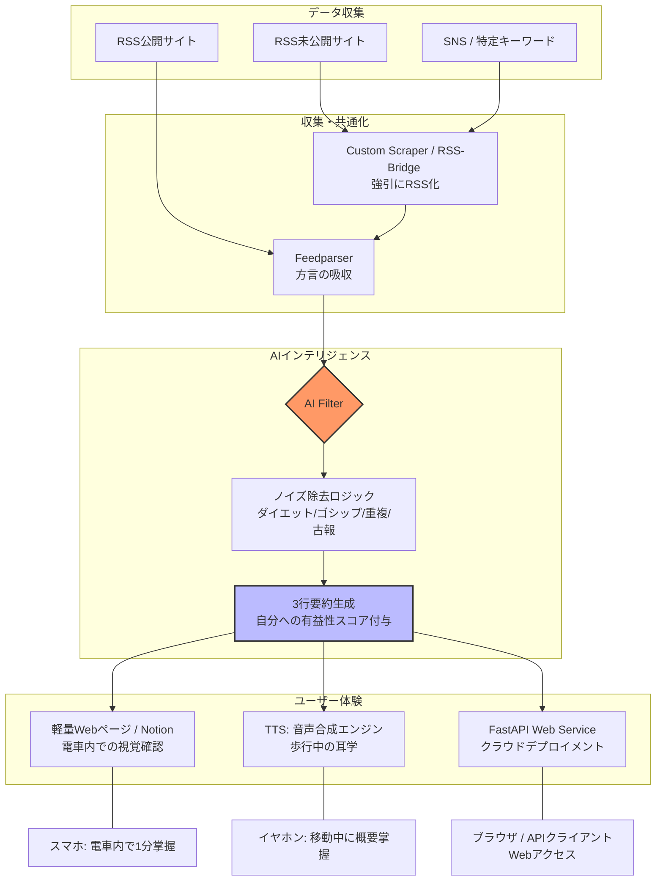
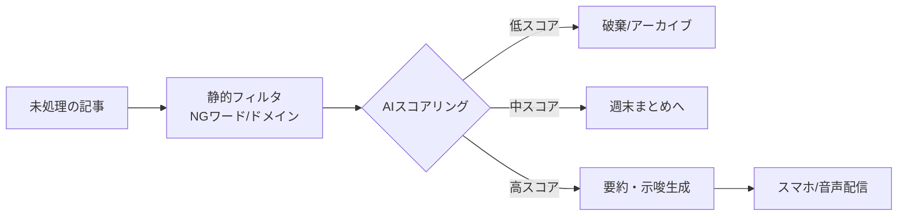

# ニュース配信システム設計図

## プロジェクト構成

```
.
├── .gitignore
├── Procfile
├── README.md
├── requirements.txt
├── main.py
├── docs/
│   ├── design_document.md
│   ├── personalization_questions.md
│   ├── virtual_environment_manual.md
│   └── github_ignore_guide.md
└── config/
    └── AI_filtering_prompt.md
```

### 構成のポイント
*   **`docs/` ディレクトリ**: 設計図、パーソナライズ質問、仮想環境マニュアル、Git無視ガイドなどのドキュメントを整理。
*   **`config/` ディレクトリ**: AIフィルタリングプロンプトなどの設定ファイルを配置。
*   **ルートディレクトリ**: FastAPIアプリケーション (`main.py`)、依存関係 (`requirements.txt`)、Webサーバー設定 (`Procfile`)、Git設定 (`.gitignore`) を配置。

## システム構成図 (Mermaid形式)



### 構成のポイント
*   **共通化（Feedparser）**: どんなサイトから来た情報も、一度「共通のRSS形式」に変換することで、その後のAI処理を一箇所に集約（シンプル化）しています。
*   **AI Filter（ゲートキーパー）**: ここがこのサービスの「肝」です。単なる要約だけでなく、あなたの関心事（自動車業界やソフトウェア開発）に基づいた**「優先順位付け」と「ゴミ捨て」**を同時に行います。
*   **バイモーダル出力**: 「耳」で聴いた情報を「目」で確認できるよう、同じ要約データを音声ファイルと軽量テキスト（Web/Notion）の両方に流します。

## AIフィルタリング層のフィルター案

AIフィルタリング層は、このサービスの「脳」にあたる最も重要な部分です。雑多なニュースを「あなた専用のインテリジェンス」に変えるために、3つのレイヤーでフィルターを構成します。

1.  **静的フィルター（ゴミ捨て）**
    LLM（AI）を使う前段階で、計算リソースを節約しつつ明らかに不要な情報を遮断します。
    *   **キーワード・ブラックリスト**: 「痩せる」「投資」「裏技」「速報（中身のないもの）」など、あなたが疲弊を感じるワードを正規表現や単純一致で除外します。
    *   **ドメイン・フィルタリング**: 信頼性の低いまとめサイトや、コピペ記事の多いドメインをあらかじめホワイトリスト/ブラックリストで管理します。
    *   **鮮度・重複チェック**: 記事の公開日時を確認し、24時間以上前のものは捨てる。また、URLやタイトルが類似しているものは「重複」として1つにまとめます。

2.  **セマンティック・フィルター（意味の理解）**
    ここからAI（LLM）を活用します。単なるワード一致ではなく「文脈」で判断します。
    *   **「再放送」検知**: 「内容自体は新しいが、事象としては数日前から報じられているもの（例：ある不具合の続報だが進展がないもの）」をAIに判定させ、優先度を下げます。
    *   **ペルソナ・マッチング**: あなたの現在の関心事（例：自動車IoT、TCU開発、プロジェクト管理、英語学習）に関連するかを「0〜100点」でスコア化。
        *   低スコア（0-40）: 非表示。
        *   中スコア（41-75）: 週末のダイジェストへ。
        *   高スコア（76-100）: 即時通知・要約対象。

3.  **コンテクスチュアル・サマリー（自分事化）**
    フィルターを通過した「有益な情報」を、どう見せるかの加工プロセスです。
    *   **「なぜ私に関係あるか」の明示**: 単なる要約ではなく、「これは現在のTCUプロジェクトにおける通信モジュールの選定に影響する可能性があります」といった**示唆（Insight）**を1行添えます。
    *   **専門用語の平易化・構造化**: 電車内での1分掌握を助けるため、複雑なニュースを「背景・結論・今後の注視点」の3つのバレットポイントに強制変換します。

### AIへの具体的なプロンプト案
詳細は `config/AI_filtering_prompt.md` を参照してください。

### フィルターの運用イメージ (Mermaid形式)



## リリース計画

「1時間後、2日後、1週間後」という非常にタイト、かつスリリングなスケジュールですね！
この時間軸で進めるには、**「既存ツールの徹底活用」と「手動運用の自動化への昇華」**という戦略が不可欠です。

以下に、段階的なリリース計画（ロードマップ）を提案します。

### 【フェーズ1】 1時間後：プロトタイプ（MVP 0.1）
*   **目標**: まずは「情報の洪水」をせき止め、AIのフィルタリング精度を確認する
*   **やること**:
    *   ソースの選定: 最も信頼しているRSSフィードを3つ選ぶ。
    *   AIへの直接投入: RSSリーダー（またはブラウザ）から、気になる記事のタイトル数件をコピー。
    *   手動プロンプト実行: ChatGPT等のWeb UIに「AIフィルタリング層」で検討したプロンプトを貼り付け、要約を出力させる。
    *   FastAPIアプリケーションの作成: `main.py` で基本構造を構築し、環境変数からAPIキーを読み込む。
*   **成果物**: 自分専用の「3行要約ニュースレター（手動作成）」およびFastAPIベースのWebサービス雛形。
*   **評価**: AIが「ノイズ」と「有益な情報」を正しく見分けられているか、プロンプトを微調整する。

### 【フェーズ2】 2日後：半自動化（MVP 1.0）
*   **目標**: 電車で読む「テキスト版」を自動で受け取れるようにする
*   **構成**:
    *   収集: Make等を使って、RSSフィードの新着を監視。
    *   フィルタ: Makeの「OpenAIモジュール」に記事を送り、フィルタリング＆要約。
    *   配信: 要約されたテキストを、自分宛のSlackやLINE Notifyに送信する。
*   **成果物**: 30分おきに自動で届く「ノイズ除去済み・3行要約通知」。
*   **ユーザー体験**: 電車の中で、URLを踏まずにチャット画面だけで最新情報を掌握できる。

### 【フェーズ3】 1週間後：フル機能版（Release 1.0）
*   **目標**: 「耳から目へ」の連携と、RSS未対応サイトの攻略
*   **構成**:
    *   「強引に」収集: RSSがないサイトに対して「RSS-Bridge」やスクレイピング（Python/Node.js）を導入し、取得範囲を拡大。
    *   音声化（耳）: 要約テキストを音声合成API（OpenAI TTSなど）に通し、MP3ファイルを生成。
    *   ストック（目）: 音声の元になったテキストを、Notionや軽量な自作Webサイトにアーカイブ。
    *   重複排除の洗練: 複数のサイトで同じニュースが出た場合、AIに「これは既報です」と統合させるロジックを実装。
*   **成果物**:
    *   歩きながら聴ける「自分専用ポッドキャスト」
    *   電車で確認できる「図解・詳細アーカイブ」
*   **ユーザー体験**: 「情報の防波堤」が完成し、ノイズに疲弊しない生活が確立。

### まとめ：各フェーズの成果物
| タイミング | ステータス | 配信先          | 主な価値                 |
| :--------- | :--------- | :-------------- | :----------------------- |
| 1時間後    | 手動検証   | メモ帳 / ChatGPT | プロンプト（AIの目）の精度確定 |
| 2日後      | 自動化     | Slack / LINE    | 電車内での「視覚」掌握の自動化 |
| 1週間後    | 完結型     | 音声 + Notion   | 「耳」と「目」のシームレスな体験 |